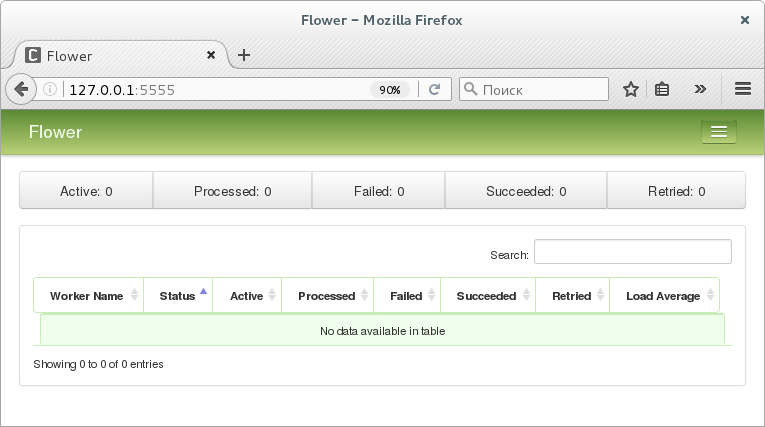

# Rookery (с использованием Celery)

Идея и описание [Rookery](https://github.com/BorisPlus/otus_webpython_020_021)

## Предварительно

Возможно вам понадобится `su` или `sudo`:

```bash 
# for using Redis as a message transport or as a result backend.
pip3 install -U "celery[redis]" 	
```

или

```bash
pip3 install -r requirements.txt 
```

## Используем Flower

```bash 
pip3 install flower
```

Запустите

```bash
cd ./rookery
flower -A app --port=5555
```

или

```bash
cd ./rookery
celery flower -A app --address=127.0.0.1 --port=5555

```

в терминале:

```text
[I 181105 13:29:02 command:139] Visit me at http://localhost:5555
[I 181105 13:29:02 command:144] Broker: amqp://guest:**@localhost:5672//
[I 181105 13:29:02 command:147] Registered tasks: 
    ['app.hello',
     'celery.accumulate',
     'celery.backend_cleanup',
     'celery.chain',
     'celery.chord',
     'celery.chord_unlock',
     'celery.chunks',
     'celery.group',
     'celery.map',
     'celery.starmap']
[I 181105 13:33:31 mixins:224] Connected to redis://localhost:6379/0
[W 181105 13:33:34 control:44] 'stats' inspect method failed
[W 181105 13:33:34 control:44] 'active_queues' inspect method failed
[W 181105 13:33:34 control:44] 'registered' inspect method failed
[W 181105 13:33:34 control:44] 'scheduled' inspect method failed
[W 181105 13:33:34 control:44] 'active' inspect method failed
[W 181105 13:33:34 control:44] 'reserved' inspect method failed
[W 181105 13:33:34 control:44] 'revoked' inspect method failed
[W 181105 13:33:34 control:44] 'conf' inspect method failed
```




